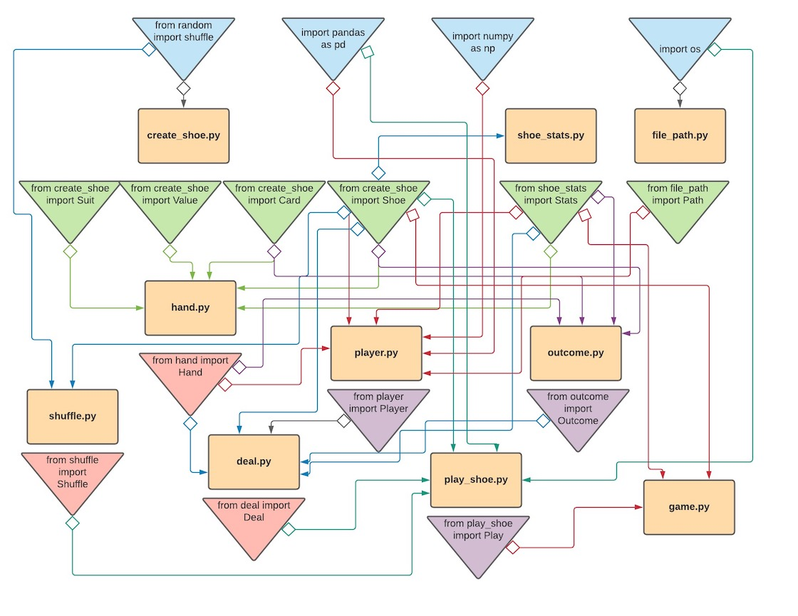

# Blackjack Project

## Introduction

Create a blackjack program that:<br/>
(i) allows a single user to continuously play blackjack hands from a six-deck shoe<br/>
(ii) uses basic strategy to run through blackjack hands for x number of six-deck shoes<br/>
(iii) analyzes the accuracy of basic strategy by using the player's first two cards and the dealer's up card to predict the outcome of the hand

## Purpose

The purpose of this project is to examine the efficacy of using basic
strategy when playing blackjack. Due to the inability to collect real data in a
casino, examining basic strategy using a computer program allows a researcher
to measure the actual outcome.

### My Basic Strategy Video
[](http://www.youtube.com/watch?v=futueqPxCeE "My Basic Strategy Video")


### Basic Strategy Card Matrix


### House Advantage

Based on prior research, a game with the following conditions has a house
advantage of **0.5%**:
- 6 deck shoe with cut card
- Dealer stands on soft 17s
- Player can double on the first two cards
- Player can re-split aces
- Player cannot hit split aces
- Player can split up to four hands

[Wizard of Odds House Edge Calculator](https://github.com/kaseymallette/blackjack/blob/main/images/house_edge.png)

The house advantage means that a player will lose 0.5% of the original bet.
If a player bets the same amount for every hand and plays perfect basic
strategy, the percentage of hands won and pushed should be **49.5%** (win_push_pct).

In addition, I want to explore whether the shuffle or any other relevant
data about the shoe predict win_push_pct, i.e. the number of blackjacks dealt,
the number of doubles won, the number of times the dealer busts, has a 10 showing, draws to make a hand, or draws to make 21.

### Deck

I wanted to create a deck that resembled playing cards. I also wanted the order of the deck to appear as a new deck of cards used in a casino. When the program runs, I have the user check the deck, and if all of the cards are there, I explain how to play using the keyboard to enter numbers to stand, hit, double, or split.

`Please check the deck to make sure all of the cards are there:`

:spades: ace  :spades: 2   :spades: 3  :spades: 4  :spades: 5  :spades:6 :spades: 7  :spades: 8  :spades: 9  :spades: 10  :spades: jack  :spades: queen :spades: king  <br/>:diamonds: ace   :diamonds: 2  :diamonds: 3  :diamonds: 4  :diamonds: 5  :diamonds: 6  :diamonds: 7  :diamonds: 8  :diamonds: 9  :diamonds:10  :diamonds: jack :diamonds:queen  :diamonds:king  <br/>:clubs: king  :clubs: queen  :clubs: jack  :clubs: 10  :clubs: 9  :clubs: 8  :clubs: 7   :clubs: 6   :clubs: 5   :clubs: 4   :clubs: 3 :clubs: 2  :clubs: ace  <br/>:hearts: king  :hearts: queen   :hearts: jack  :hearts: 10  :hearts: 9  :hearts: 8  :hearts: 7  :hearts:6  :hearts: 5  :hearts: 4  :hearts: 3  :hearts: 2  :hearts: ace

```
If you agree, press return.
Good luck!
If you want to stop playing, type 'exit'
To deal the first hand of the shoe, press return

Please enter a number from the following choices:
Stand: 0, Hit: 1, Double: 2, Split: 3
```

## Source Code



1. **[`create_shoe.py`](https://github.com/kaseymallette/blackjack/blob/main/blackjack/src/create_shoe.py)**

* `class Suit` has methods `__init__(self)` and `create_suits(self)`, where for any Suit object, `create_suits()` is initialized and contains the following instance attributes: heart, club, diamond, spade, and suits, which represents a list of all four suits.

```
heart = u"\u2665"
club = u"\u2663"
diamond = u"\u2666"
spade = u"\u2660"
```

* `class Value` has methods `__init__(self)` and `create_values(self)`, where for any Value object, `create_values()` is initialized, which creates a dictionary to store the card values, such that the key is the string value, and the value is the integer value of the card.

```
self.value_dict = {'ace': [1, 11], '2': 2, '3': 3, '4': 4, '5': 5, '6': 6, '7': 7, '8': 8, '9': 9, '10': 10, 'jack': 10, 'queen': 10, 'king': 10}
```

* `class Card` creates a card of suit x and value y using the methods `__init__(self, suit, value)` and `create_card(self, suit, value)`. Given a suit and value, if the suit is in s.suit and the value is in v.str, then let suit = suit, and value = value. Define the card to be equal to suit + value, where the integer value of the card (num) is determined using the value dictionary.

```
def create_card(self, suit, value):
    s = Suit()
    v = Value()

    if suit in s.suits:
        self.suit = suit
    if value in v.str:
        self.value = value

    # Define the card and its numerical value
    self.card = suit + value
    self.num = v.value_dict[value]

    # Determine if the card is an ace
    self.is_ace = False
    if value == 'ace':
        self.is_ace = True
```

* `class Deck`, with methods `__init__(self)` and `new_deck(self)`, creates a deck in new deck order by instantiating a Suit object, which contains a list of all four suits, a Value object, which contains a list of all 13 possible values, and 52 Card objects, appended to a list in new deck order.

* `class Shoe` has the following methods: <br/> `__init__(self, num, game)`, `build_shoe(self, num, game)`, `enum_shoe(self)`, `count_cards(self, list)`

For any Shoe object, `build_shoe(num, game)` is initialized, such that: <br/>
```
Num = even number of shoes
Game = play (user plays each hand) or run (computer uses basic strategy)
```

The following instance attributes are also created: <br/>
`deck, num, wash, game, return_shoe, dealer_hand, hands_played, shuffled_cards, shoe_stats, card_count, cards_remaining, shoes_dealt, shoe_index, next_card`

`enum_shoe(self)` iterates through the shoe, using shoe_index and next_card

```
def enum_shoe(self):
    self.shoe_index +=1
    self.next_card = self.return_shoe[self.shoe_index]
```

`count_cards(self, list)` checks to make sure all of the cards are there after being shuffled
<br/>
<br/>

2. **[`shoe_stats.py`](https://github.com/kaseymallette/blackjack/blob/main/blackjack/src/shoe_stats.py)**

For every hand or for every shoe, I tracked the following statistics:
```
stats = ['player_win', 'player_loss', 'push', 'total_hands', 'win_pct',
    'win_push', 'win_push_pct', 'num_of_splits', 'double', 'doubles_won',
    'doubles_lost', 'doubles_won_pct', 'player_bj', 'dealer_bj',
    'dealer_high_card', 'dealer_low_card', 'dealer_bust', 'dealer_draw',
    'dealer_stand', 'dealer_bust_pct', 'dealer_draw_pct','dealer_stand_pct',
    'dealer_avg_hand', 'num_of_shuffles', 'shuffle_method']

```
<br/>

3. **[`hand.py`](https://github.com/kaseymallette/blackjack/blob/main/blackjack/src/hand.py)**

`class Hand` contains the following methods: <br/> `__init__(self, card_1, card_2)`, `new_hand(self, card_1, card_2)`, `find_sum(self)`, `hit(self, shoe)`, `split(self, shoe)`, `dealer_up_card(self, player)`, `player_cards(self, shoe)`, `hand_move(self, move)`, `dealer_rules(self, shoe)`, `find_outcome(self, outcome)`, `get_data(self)`

For every Hand object, `new_hand(card_1, card_2)` is initialized, in which the instance attributes card_1 and card_2 are Card objects.

```
self.card_1 = Card(card_1[0], card_1[1:])
self.card_2 = Card(card_2[0], card_2[1:])

self.cards = [self.card_1, self.card_2]
self.hand = [self.card_1.card, self.card_2.card]
self.num = [self.card_1.num, self.card_2.num]
```

In order to sum the hand properly, it is important to know if the hand contains any aces. An ace counts as 1 or 11, so a soft hand (a hand that contains an ace) can be two values, while a hard hand (a hand with no aces) has a single value.

```
def find_sum(self):

    def add_to_soft(card_1, card_2):
        self.soft_small = self.soft_small + card_1
        self.soft_large = self.soft_large + card_2

    # Add each card in self.cards
    for card in self.cards:
        if self.is_soft == True:
            if card.is_ace == False:
                add_to_soft(card.num, card.num)
            else:
                self.ace_count = self.ace_count + 1
                # The first ace counts as 1 or 11
                if self.ace_count == 1:
                    add_to_soft(card.num[0], card.num[1])
                # Additional aces only count as 1
                if self.ace_count > 1:
                    add_to_soft(card.num[0], card.num[0])
        else:
            self.sum = self.sum + card.num
```

When a card is added to a hand, the card is appended to all three instance attributes (cards, hand, and num).

```
def hit(self, shoe):
    shoe.enum_shoe()
    deal_card = shoe.next_card
    new_card = Card(deal_card[0], deal_card[1:])

    # Append the card
    self.cards.append(new_card)
    self.hand.append(new_card.card)
    self.num.append(new_card.num)

    # Find the sum of the hand
    self.find_sum()
```

If the hand is split into two hands, two Hand objects are created, hand_1 and hand_2.

```
def split(self, shoe):
    shoe.enum_shoe()
    self.hand_1 = Hand(self.hand[0], shoe.next_card)

    shoe.enum_shoe()
    self.hand_2 = Hand(self.hand[1], shoe.next_card)
```

The method `dealer_rules(shoe)` contains the rules for the dealer's hand

```
# Evaluate the dealer's hand
while True:
    if self.sum > 21:
        print("Dealer busts")
        break
    elif self.sum >= 17:
        print("Dealer has: ", self.sum)
        break
    else:
        self.hit(shoe)
        continue
```
<br/>

4. **[`file_path.py`](https://github.com/kaseymallette/blackjack/blob/main/blackjack/src/file_path.py)**
<br/>

5. **[`player.py`](https://github.com/kaseymallette/blackjack/blob/main/blackjack/src/player.py)**
<br/>

6. **[`deal.py`](https://github.com/kaseymallette/blackjack/blob/main/blackjack/src/deal.py)**
<br/>

7. **[`outcome.py`](https://github.com/kaseymallette/blackjack/blob/main/blackjack/src/outcome.py)**
<br/>

8. **[`shuffle.py`](https://github.com/kaseymallette/blackjack/blob/main/blackjack/src/shuffle.py)**

I wrote a shuffle similar to the shuffle I performed as a high limit blackjack dealer. The shuffle contains two parts: riffle, in which you lace two piles of cards together, and strip, where you take sections of cards from the top and place them on the bottom.

I first defined a partition function in order to strip the cards.

```
def partition(cards, num):
    self.group = []
    for i in range(0, len(cards), num):
        new_group = cards[i:i + num]
        self.group.append(new_group)

def strip_cards(pile):
    self.strip = []
    partition(pile, self.strip_len)
    self.group = self.group[::-1]

    for x in self.group:
        for y in x:
            self.strip.append(y)
```

I then wrote a perfect riffle, in which the cards were perfectly laced together.

```
def riffle_perfect(pile_1, pile_2):
    self.riffle = []
    n = iter(pile_2)

    # Iterate through pile_1 and append next of pile_2
    for i in iter(pile_1):
        self.riffle.append(i)
        self.riffle.append(next(n))
```

I also wrote a clumpy riffle, which resembles a shuffle done by a dealer, where the cards clump together. I used a tuple that contained a random distribution of cards that determined how many cards to take at a time from each pile.

```
dist_1 = [12,10,8,2,2,2,1,1,1]
dist_2 = [12,10,6,4,2,2,1,1,1]
shuffle(dist_1)
shuffle(dist_2)

dist_tupl = []
for x,y in zip(dist_1, dist_2):
    new_tupl = (x, y)
    dist_tupl.append(new_tupl)
```
<br/>

9. **[`play_shoe.py`](https://github.com/kaseymallette/blackjack/blob/main/blackjack/src/play_shoe.py)**
<br/>

10. **[`game.py`](https://github.com/kaseymallette/blackjack/blob/main/blackjack/src/game.py)**
<br/>


## Data Collection

#### Number of Shoes
- It takes 15 minutes to shuffle and deal a six-deck blackjack shoe
- The cards are changed once every 24 hours

Given the above two assumptions, 96 shoes would be dealt in 24 hours.


#### ```test_2.py```

```# Set up directory
from run_test import Test
Test().find_dir()

# Import Path
from file_path import Path

# Set variables
test_shuffle = [1, 4, 7, 11, 'part_1', 'part_2', 'casino']
test_shoes = 96
run_time = 7
shoe_fh = Path('shoe_test_2.csv').path
hand_fh = Path('hand_test_2.csv').path

# Run test
for shuffle in test_shuffle:
    for i in range(run_time):
        Test().run_test(shuffle, test_shoes, shoe_fh, hand_fh)
```

## Data Defintions

*hand_data.csv*
variable | definition | key
------ | ------------ | ---
dealer_up | Dealer's up card | A, 2, 3, 4, 5, 6, 7, 8, 9, 10
player | Player's hand | 5-21, soft hands, or pairs
move | Player's first move | 0 = stand, 1 = hit, 2 = double
outcome | The outcome of the hand | win, loss, or push
dealer_bj | Whether or not the dealer had blackjack |
is_split | Whether or not the hand was split |
orig_hand | If the hand was split, the original hand that was dealt | If not split, 0
shuffle | The shuffle method used | 1, 3, 5, 9, 15, part_1, part_2, casino

*shoe_data.csv*
variable | defintion
------ | -----------
player_win | The number of hands the player won
player_loss | The number of hands the player lost
push | The number of hands the player pushed (tied)
win_push | The number of hands both won and pushed
total_hands | The total number of hands dealt in the shoe
win_pct | The percentage of hands won
win_push_pct | The percentage of hands won and pushed
doubles_won | The number of hands the player doubled and won
doubles_lost | The number of hands the player doubled and lost
doubles_won_pct | The percentage of hands doubled that the player won
player_bj | The number of hands the player was dealt blackjack
dealer_bj | The number of hands the dealer was dealt blackjack
dealer_ten | The number of hands the dealer had a 10 showing
dealer_bust | The number of hands the dealer busted (hand > 21)
dealer_draw | The number of hands the dealer hit and stood on 17-21
dealer_21_draw | The number of hands the dealer hit and drew to 21
dealer_ten_pct | The percentage of total hands the dealer had a 10 showing
dealer_bust_pct | The percentage of total hands the dealer busted
dealer_draw_pct | The percentage of total hands the dealer drew to make a hand
dealer_21_draw_pct | The percentage of total hands the dealer drew to 21
dealer_avg_hand | The average hand of the dealer when hand < 21
num_of_shuffles | The number of shuffles of the same shoe
shuffle_method | The shuffle method used to shuffle the shoe


## Project Directory
